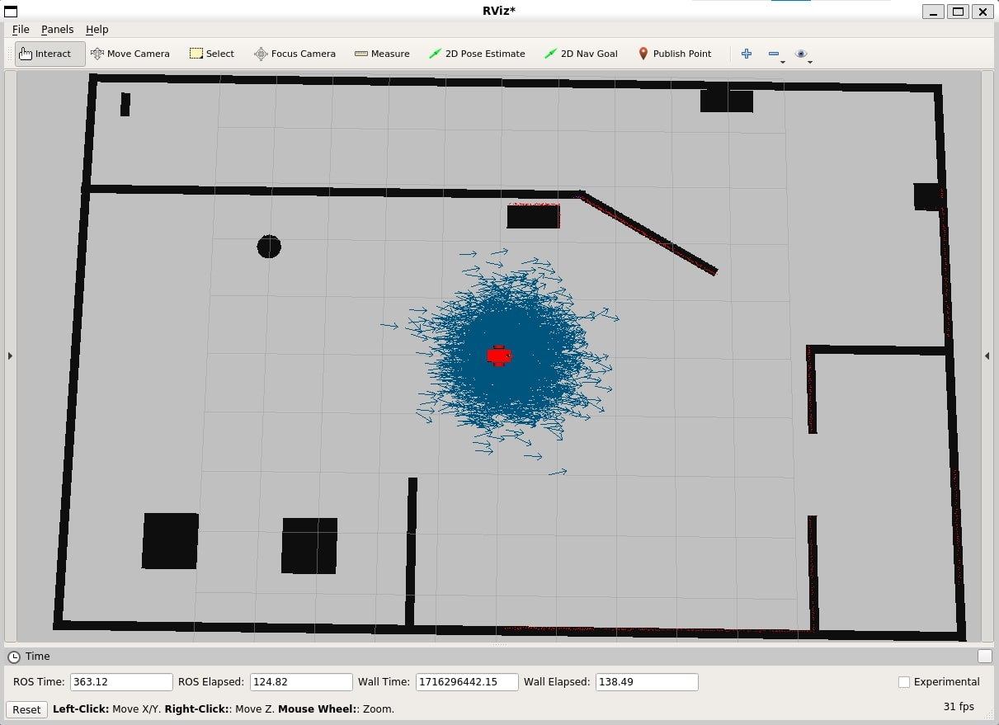
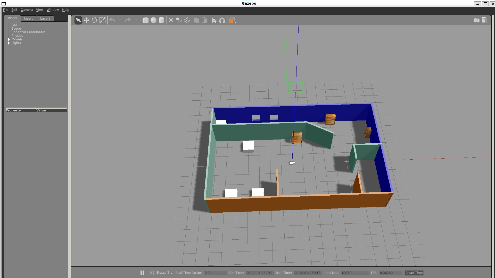
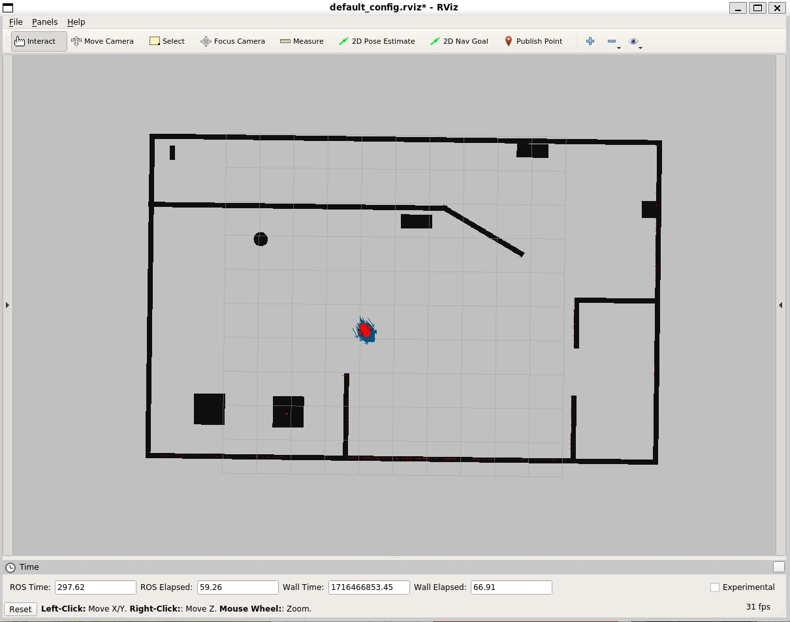
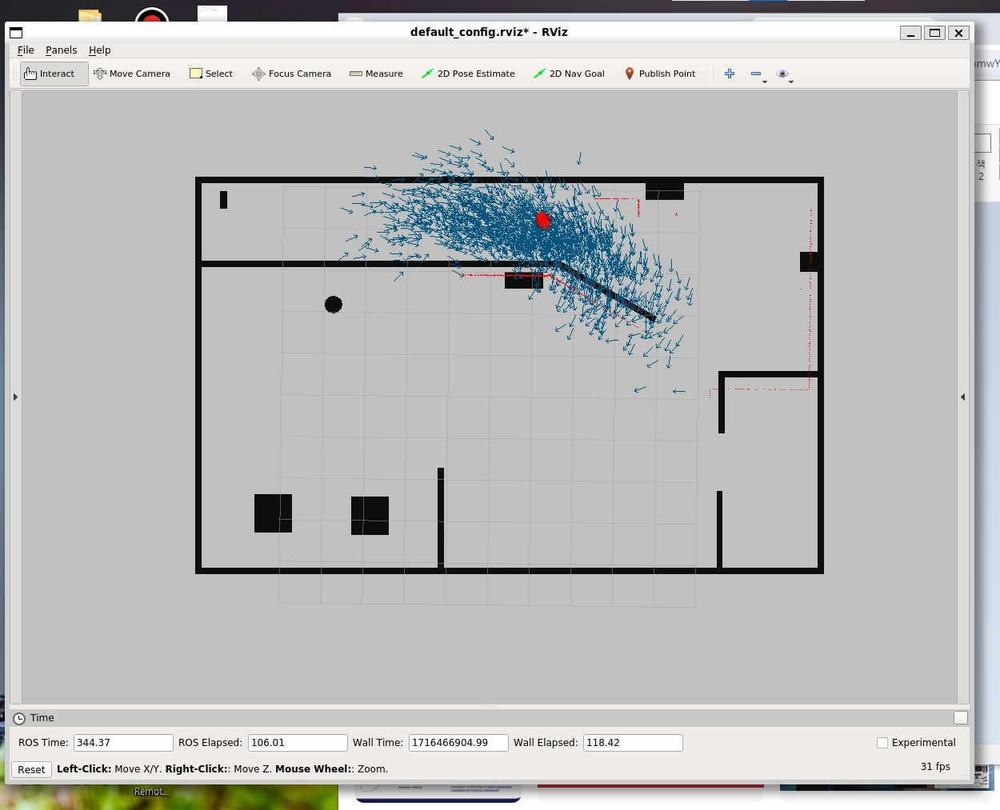
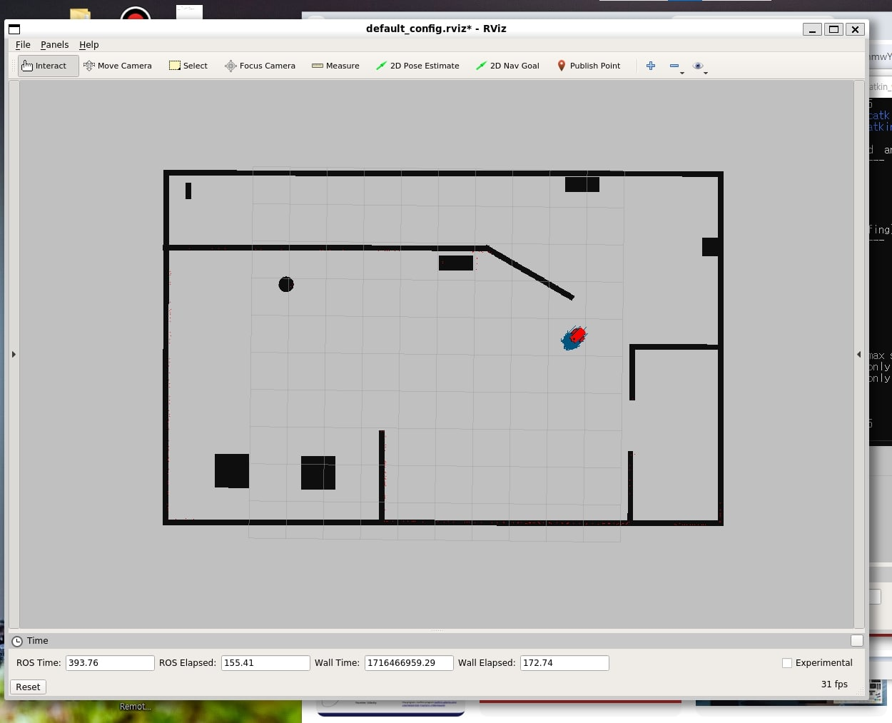

# Where Am I
The goal of this project is localize the robot with Adaptive Monte Carlo Localization.

## Before getting started
* Ubuntu-16.04  
* ROS Kinetic  
* Gazebo-7.x.x
```console
$ sudo apt-get install ros-kinetic-navigation
$ sudo apt-get install ros-kinetic-map-server
$ sudo apt-get install ros-kinetic-move-base
$ sudo apt-get install ros-kinetic-amcl   # ROS Package for Adaptive Monte Carlo Localization(AMCL)
```

## Build and Launch
Once you have installed all the prerequisites, you need to build the packages.
```console
$ cd ~/catkin_ws
$ catkin_make
```
Then you may have build and devel directoiries. Now time to launch!
```console
$ source devel/setup.bash
$ roslaunch my_robot world.launch
```
Open a new terminal, then launch AMCL.
```console
$ source devel/setup.bash
$ roslaunch my_robot amcl.launch
```
To control the robot with a keyboard, you may need 'Teleop Package'. Open another terminal execute the commands below.
```console
$ cd ~/catkin_ws/src
$ git clone https://github.com/ros-teleop/teleop_twist_keyboard
$ cd ..
$ catkin_make
$ source devel/setup.bash
$ rosrun teleop_twist_keyboard teleop_twist_keyboard.py
```

## Result
Once you launch the packages properly, the initial state may look like the picture below. At initail state, the arrows which represent the estimation of robot's location and direction are pretty scattered. In this case, the robot can't estimate their state(location and direction) precisely.  
|Rviz|Gazebo|
|:---:|:---:|
|||  

As I just mentioned, you can use Teleop Package to control robot with a keyboard. After making sevral movements, you probably have this result. Now the arrows are gathered near the robot.    
   

What if someone picks up the robot and relocates it on a random spot? Can robot deal with this? Yes, he can.
|Pick up and relocate|Re-localization|
|:---:|:---:|
|||  
